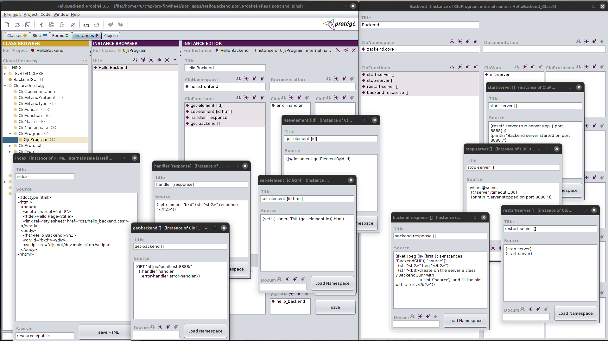

# pro-figwheel

### Simple Clojure/ClojureScript IDE based on Protege and Figwheel-main



IDE based on:

1. Protege 3.5 ontology editor [https://protegewiki.stanford.edu/wiki/Protege_Desktop_Old_Versions](https://protegewiki.stanford.edu/wiki/Protege_Desktop_Old_Versions)
2. Clojure Tab plugin to Protege [https://protegewiki.stanford.edu/wiki/ClojureTab](https://protegewiki.stanford.edu/wiki/ClojureTab)
3. Figwheel Main ClojureScript library [https://github.com/bhauman/figwheel-main](https://github.com/bhauman/figwheel-main)

## Start with CLI tools

```clj
$ clj  -M:pro
```

## Start with Leiningen

```clj
$ lein run
```

## Short video lessons 

1. [Hello World](https://www.youtube.com/watch?v=EKE1dBizp6U)

2. [Hello Page](https://www.youtube.com/watch?v=PQULRwcAITo)

3. [Hello Backend](https://www.youtube.com/watch?v=12oEoJJOn30)

4. [Hello Arttuka](https://youtu.be/xVGlMQBEX2A) - it introduces modern web GUI with the help of Arttuka's Reagent wrapper for MUI (formerly Material UI)[https://github.com/arttuka/reagent-material-ui](https://github.com/arttuka/reagent-material-ui)


*Note on the lessons: When constructing ClojureScript programs for functions, you should create instances of the “CljsFunction” class, and not “CloFunction” as in the videos.*

## Description 

Used Protege 3.5 version a little bit old. It is *Frame-based*. Recent Protege versions are *OWL-based*. It is superfluous for our purposes.

This IDE has 2 important differences from traditional ones.

1. With Protege, it allows you to first construct the application domain **visually** and manipulate it using Protege's GUI. Then add functionality to the application using Clojure programs. And finally, if necessary, develop a front-end using ClojureScript programming.
This is especially useful for rapid prototyping.

2. The programming environment in Protege GUI is multi-window. **Each function has a separate window**. This allows quite a lot of functions to be displayed on the screen at the same time (given Clojure's inherent short function paradigm), and from different namespaces! Each function window has a button to save and compile its namespace. This creates additional convenience when debugging.

## License

Copyright © 2023 Ruslan Sorokin

Distributed under the Eclipse Public License either version 1.0 or (at
your option) any later version.
